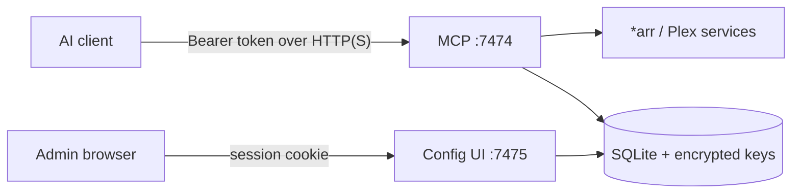

# mcparr threat model

This is a short, practical threat model for a single-node homelab deployment. It
records the trust boundaries, the assets worth protecting, and what the design
does (and deliberately does not) defend against.

## Assets

- **Service API keys** (Radarr, Sonarr, ...). Stored encrypted at rest.
- **The MCP bearer token.** Grants tool access to every enabled service.
- **The admin password.** Controls the config UI.
- **Media control.** An attacker with tool access can add or (if enabled) delete
  media.

## Trust boundaries

- **Port 7474 (MCP):** internet-reachable when used with remote connectors. Auth
  is always on; every request needs a valid bearer token.
- **Port 7475 (UI):** bound to localhost by default. It is the most sensitive
  surface because it can read keys and rotate the token. Expose it only via SSH
  tunnel or an authenticating reverse proxy.
- **Data volume:** holds the SQLite DB, the Fernet key, the MCP token, and the
  audit log. Treat it as secret; back it up.

## What the design defends against

- **Unauthenticated MCP access:** rejected with 401; constant-time token check.
- **Secrets at rest:** API keys encrypted with Fernet; key and token are `0600`
  files, never committed (enforced by `.gitignore` / `.dockerignore`).
- **CSRF / DNS-rebinding on the UI:** SameSite=Strict session cookie, CSRF tokens
  on state-changing POSTs, and an Origin/Host check.
- **Brute-forcing the admin password:** argon2id hashing plus login throttling.
- **SSRF via service URLs:** scheme restricted to http/https; link-local and
  cloud-metadata hosts blocked.
- **Runaway clients:** per-instance concurrency caps and request timeouts.
- **Container blast radius:** non-root user, dropped capabilities,
  `no-new-privileges`, read-only root filesystem with only `/data` writable.

## Out of scope / accepted risks

- **A leaked MCP token** grants full tool access. Rotate it from the UI if
  exposed; rotation invalidates the old token immediately.
- **A compromised admin session** can do anything the UI can. Keep 7475 off the
  open internet.
- **Plaintext HTTP** on a LAN is accepted for local use. Hosted connectors
  require HTTPS - terminate TLS at a reverse proxy.
- **Scoped (read-only vs read-write) tokens** are not yet implemented; destructive
  tools are instead gated per service and off by default.
